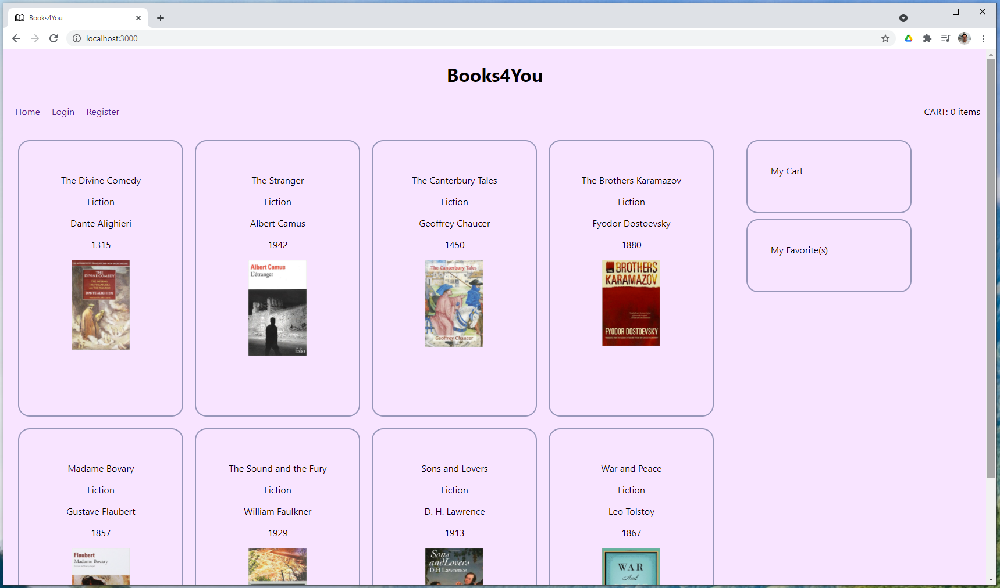
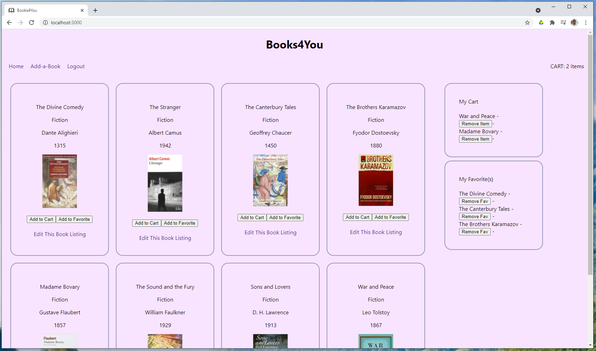

# Week13 - React - Redux - JWT - Full Stack

## Books4You
This was an assigment to get us familiar with React and Redux, setting up and manipulating the global state on the client side.

Server side holds the books added and provides authentication with a json web token for a component.

View it Live at [x2y1.org](http://x2y1.org/)

Not Logged in:

Logged in Allowing you to Add and Remove from Cart and Favorites:

